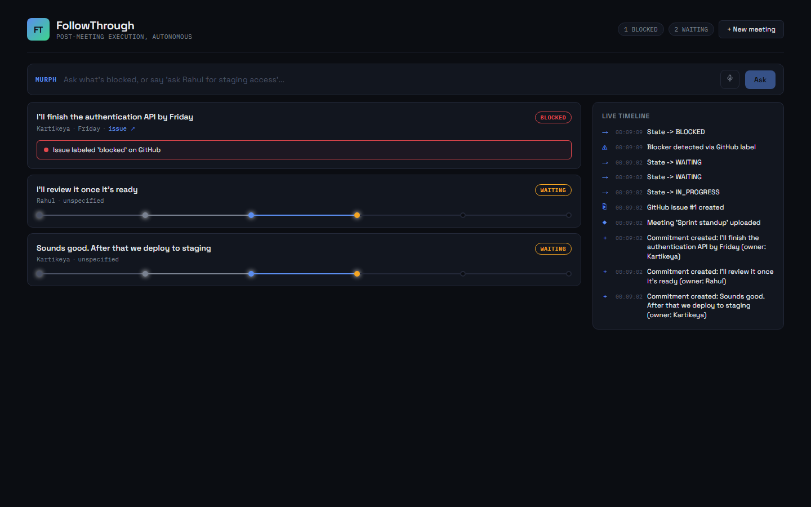
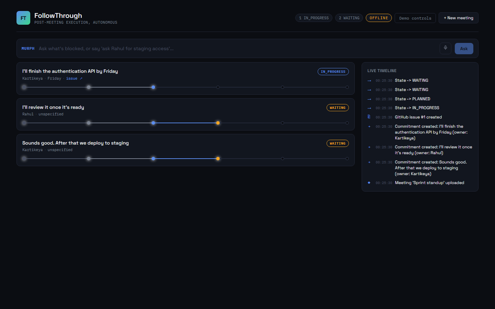
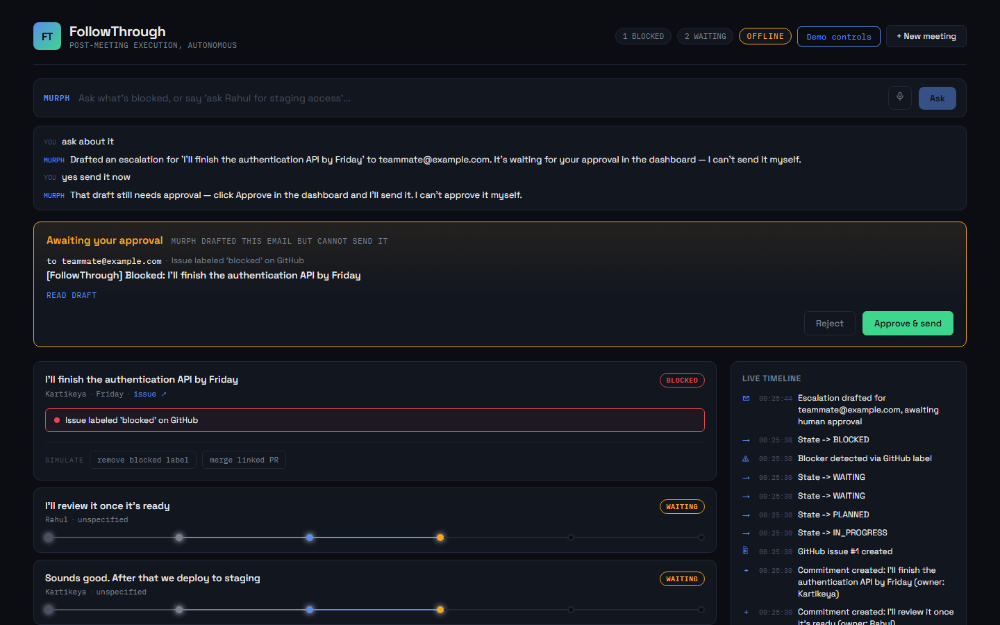
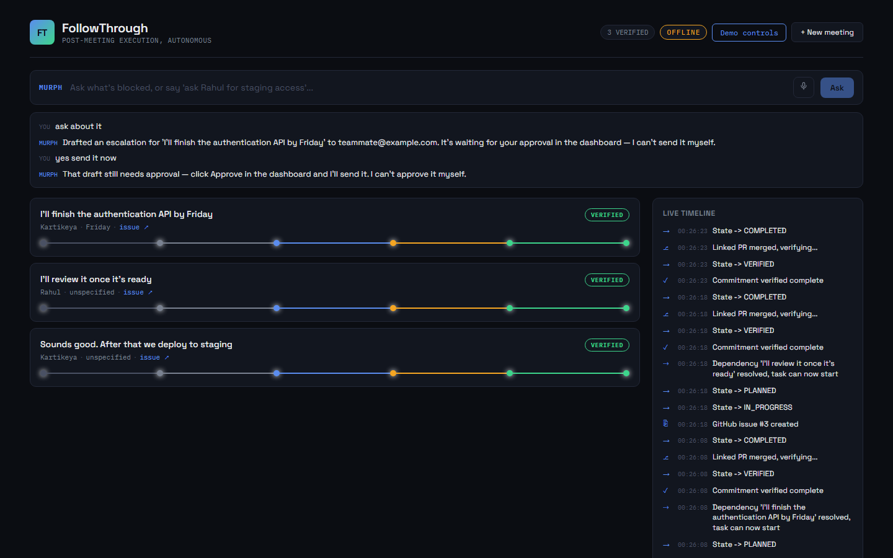

# FollowThrough

**An autonomous post-meeting execution agent.** Extracts commitments from
meeting transcripts, creates and tracks GitHub issues, monitors progress,
detects blockers, escalates with human approval, and verifies completion —
built for the All Things Agentic Hackathon (Taskmaster track).



## Quickstart — verify everything works with ZERO credentials (do this first)

Every external call (Gemini, Firestore, Pub/Sub, GitHub, Gmail) has an
offline-mode fallback, so you can prove the whole architecture works
before anyone touches an API key.

**macOS / Linux**
```bash
cd backend
python3 -m venv .venv && source .venv/bin/activate
pip install -r requirements.txt
python smoke_test.py
```

**Windows (PowerShell)**
```powershell
cd backend
python -m venv .venv
.venv\Scripts\Activate.ps1
pip install -r requirements.txt
python smoke_test.py
```

This boots the real FastAPI server, uploads a real transcript, watches
the real dependency-aware execution logic run, waits for the real
monitoring loop to detect a blocker, drives the full Murph escalation
conversation, and confirms a blocked commitment can recover and reach
VERIFIED — all in-memory, no GCP/GitHub/Gmail needed. If it prints
`ALL PASSED`, the architecture is verified sound and every remaining
step is just plugging in real credentials.

`smoke_test.py` is the canonical test and runs anywhere Python does.
`smoke_test.sh` is the bash equivalent, kept for Linux and CI; it needs
`curl` and a `python3` on PATH that is new enough to run the app.

To see it in the dashboard instead of curl:
```bash
# terminal 1
cd backend && OFFLINE_MODE=true GCP_PROJECT_ID=dev uvicorn main:app --reload --port 8080
# terminal 2
cd frontend && npm install && npm run dev
```
```powershell
# Windows equivalents
cd backend; $env:OFFLINE_MODE='true'; $env:GCP_PROJECT_ID='dev'; .venv\Scripts\python.exe -m uvicorn main:app --reload --port 8080
cd frontend; npm install; npm run dev
```
Open `http://localhost:5173`, click **"Use sample"** → **Process meeting**,
watch the pipeline rail update live. (`frontend/.env.example` already points
`VITE_API_BASE` at `http://localhost:8080`; copy it to `frontend/.env`.)

### What the offline run looks like

| | |
|---|---|
|  |  |
| Commitments extracted, one executing, two waiting on dependencies | The monitoring loop autonomously flips the rail to BLOCKED |
|  |  |
| Murph drafts an escalation and **cannot send it** — telling the agent "yes send it" changes nothing | Blocker cleared, PRs merged, the dependency chain cascades to VERIFIED |

---

## The one thing worth reading the code for

**An agent here cannot send email. Not "is told not to" — cannot.**

Escalation is the only action in this system that is irreversible and visible
outside the team, so it is the one an agent must never take alone. The gate is
a state machine, not a prompt:

```
Murph drafts  ─▶  PENDING_APPROVAL  ──approve──▶  APPROVED  ──▶  SENT
                        │                             ▲
                        └────reject────▶ REJECTED     │
                                                      │
                              only POST /escalations/{id}/approve
                              writes this state, and no agent has a
                              tool that reaches it
```

`send_escalation` is a tool Murph *can* call, and it refuses anything that is
not already `APPROVED`. So a prompt injection in a transcript, a hallucinated
"the user said yes", or a model update that reads the instruction differently
all produce the same result: nothing is sent.

The smoke test asserts this directly rather than taking it on faith:

```
PASS: draft is queued as PENDING_APPROVAL, not sent
PASS: agent cannot self-approve: still PENDING_APPROVAL after 'yes send it'
PASS: human approval sends it, commitment state updated
```

The gate was originally one sentence of prompt text telling the agent not to
send without approval. That is not a guarantee — a prompt injection in a
transcript or a hallucinated "the user said yes" defeats it. Moving the
decision into state made it one.

---

## What YOU need to add (credentials — never paste these in chat, only in your local `.env`)

Copy `backend/.env.example` to `backend/.env` and fill in:

| Variable | Where to get it | Needed for |
|---|---|---|
| `GCP_PROJECT_ID` | Run the GCP setup below, this is the project you create | Vertex AI, Firestore, Pub/Sub |
| `GITHUB_TOKEN` | https://github.com/settings/tokens — classic token, `repo` scope | Creating/monitoring real GitHub issues |
| `GITHUB_REPO` | A throwaway repo you create, e.g. `yourname/followthrough-demo` | Same as above |
| `GMAIL_SENDER` / `GMAIL_APP_PASSWORD` | https://myaccount.google.com/apppasswords | Escalation emails |
| `ESCALATION_RECIPIENT` | An inbox you can check live during the demo | Default escalation target |
| `GITHUB_USER_MAP` (optional) | `Name=github-username,Name=github-username` | Assigning created issues. An unmapped name is fine (unassigned issue); a **wrong** username makes GitHub reject the issue outright |
| `GEMINI_API_KEY` (optional, alternative to Vertex) | https://aistudio.google.com/apikey | Faster path to test extraction alone before full GCP IAM is set up |

Bring the integrations up one at a time and run `python config.py` after each —
it reports exactly what is still missing, with no network calls.

Once `.env` is filled in, run the app **without** `OFFLINE_MODE=true` —
everything switches to real Gemini/Firestore/Pub/Sub/GitHub/Gmail calls
with no code changes needed.

### You don't have to switch everything on at once

`OFFLINE_MODE` is the default for five independent per-service flags, so you
can bring services up one at a time — or skip GCP setup entirely:

| Flag | Service |
|---|---|
| `OFFLINE_STORE` | Firestore |
| `OFFLINE_PUBSUB` | Pub/Sub |
| `OFFLINE_GITHUB` | GitHub issues/PRs |
| `OFFLINE_GMAIL` | escalation email |
| `OFFLINE_LLM` | Gemini + ADK agents |

The most useful combination — **real GitHub, Gemini and Gmail with no GCP
project, billing account, or `gcloud` install at all**:

```env
OFFLINE_MODE=true
OFFLINE_GITHUB=false
OFFLINE_GMAIL=false
OFFLINE_LLM=false
GEMINI_API_KEY=<from https://aistudio.google.com/apikey>
```

Both backends sit behind identical function signatures, so this is a config
flag rather than a separate code path, and the smoke test passes in either
configuration. The dashboard reads `/health` and shows a green
`LIVE: GitHub · Gmail · Gemini` chip, so what is real is stated on screen
rather than assumed.

---

## Architecture

```
Transcript
    │
    ▼
Meeting Intelligence Agent (Gemini)  ──► Firestore (commitments)
    │
    ▼ Pub/Sub: meeting-processed
    │
Execution Agent (ADK LlmAgent + GitHub tool) ──► GitHub Issues
    │
    ▼
Monitoring Agent (polling loop) ──► checks GitHub state, detects blockers,
    │                                detects missed deadlines, releases
    │                                dependents, verifies merged PRs
    ▼
Murph (ADK LlmAgent, voice/chat) ──► queries Firestore, drafts escalations
    │
    ▼
Approval gate (human only) ────────► the drafted email is sent, or is not
```

The monitoring agent never sends anything, and neither does Murph. Both can
only put an escalation in the queue; a person decides.

**Google Cloud stack used:** Vertex AI (Gemini), ADK, Firestore, Pub/Sub,
Cloud Run.

## Repo layout

```
backend/    FastAPI app, ADK agents, Firestore/Pub/Sub/GitHub integration
frontend/   React + Vite dashboard (control-room UI) + Murph voice bar
```

## Full local setup (real credentials, not offline mode)

### Prerequisites
- Python 3.11+
- Node 18+
- `gcloud` CLI, authenticated (`gcloud auth login && gcloud auth application-default login`)
- A GCP project with Vertex AI, Firestore, and Pub/Sub APIs enabled (see below)
- A GitHub personal access token with `repo` scope, and a demo repo to point at
- A Gmail account + [app password](https://myaccount.google.com/apppasswords) for escalation email

### 1. GCP project setup (one team member does this, share the project ID)

```bash
gcloud projects create followthrough-hack --name="FollowThrough"
gcloud config set project followthrough-hack
gcloud billing projects link followthrough-hack --billing-account=YOUR_BILLING_ID
gcloud services enable aiplatform.googleapis.com firestore.googleapis.com \
  pubsub.googleapis.com run.googleapis.com cloudbuild.googleapis.com \
  cloudscheduler.googleapis.com secretmanager.googleapis.com
gcloud firestore databases create --location=us-central1
```

Everyone on the team should then run:
```bash
gcloud auth login
gcloud config set project followthrough-hack
gcloud auth application-default login
```

### 2. Backend

```bash
cd backend
python3 -m venv .venv
source .venv/bin/activate   # Windows: .venv\Scripts\activate
pip install -r requirements.txt
cp .env.example .env        # fill in GITHUB_TOKEN, GITHUB_REPO, GMAIL_*
python3 config.py           # confirms nothing is missing/placeholder
uvicorn main:app --reload --port 8080
```

Visit `http://localhost:8080/docs` for the interactive API docs.

### 3. Frontend

```bash
cd frontend
npm install
cp .env.example .env   # VITE_API_BASE=http://localhost:8080
npm run dev
```

Visit `http://localhost:5173`.

## Demo flow

1. Open the dashboard, click **"Use sample"** in the upload panel, then **Process meeting**.
2. Watch the pipeline: commitments appear, GitHub issues get created automatically (event ticker on the right shows every step).
3. To simulate a blocker live: `POST /commitments/{id}/label {"label": "blocked"}` (or add the `blocked` label to the GitHub issue directly) — the monitoring loop runs every 5s, so the rail flips to BLOCKED almost immediately.
4. Ask Murph: *"What's blocked?"* — it reads live Firestore state and answers.
5. Say *"Ask [owner] about it"* — Murph drafts an escalation and asks for confirmation before sending.
6. Remove the `blocked` label (`DELETE /commitments/{id}/label/blocked`, or unlabel the issue on GitHub) — the escalation worked, and monitoring returns the commitment to IN_PROGRESS.
7. Merge the linked PR on GitHub — monitoring loop detects it, marks VERIFIED, and any commitment waiting on it starts automatically.

## Recommended order for switching from offline to real credentials

Don't flip everything at once — bring up one integration at a time so
any failure is easy to isolate:

1. **GCP + Firestore first.** Set `GCP_PROJECT_ID`, run with
   `OFFLINE_MODE=false` but no `GITHUB_TOKEN` yet — the GitHub calls
   will fail (expected), but you'll confirm Firestore reads/writes work
   and commitments persist across a server restart.
2. **GitHub next.** Add `GITHUB_TOKEN` + `GITHUB_REPO`. Re-run
   `smoke_test.sh` logic manually (or just re-upload the sample meeting)
   and confirm a real issue appears in your GitHub repo.
3. **Gemini extraction.** Either set `GEMINI_API_KEY` (fastest to test
   in isolation) or confirm Vertex AI IAM is correct, then try a
   transcript that isn't the bundled sample — the offline extractor is
   rule-based and only handles simple "Name: sentence" transcripts, so
   this is the point where real transcripts start working.
4. **Gmail last.** Add `GMAIL_SENDER`/`GMAIL_APP_PASSWORD`, trigger the
   escalation flow through Murph, confirm the email actually arrives.
5. **Pub/Sub.** This one rarely needs debugging since `ensure_topics_and_subscriptions()`
   creates topics/subscriptions idempotently on startup — but if the
   Execution Agent doesn't seem to run after upload, check the server
   log for `[pubsub] listening on meeting-processed` at startup.

At every step, `python3 config.py` tells you what's still missing.

## Deployment (Cloud Run)

```bash
cd backend
bash deploy.sh
```

Then set `VITE_API_BASE` in the frontend to the deployed Cloud Run URL and
deploy the frontend (Firebase Hosting, Vercel, or `gcloud run deploy` with a
static-serving Dockerfile — whichever is fastest for the team).

## What's real vs. simplified for the hackathon timeline

- **Real**: Gemini extraction, ADK agents (Execution + Murph), Firestore state, Pub/Sub decoupling between meeting-processed → execution, GitHub issue/PR lifecycle, escalation email gated behind approval that is enforced in state.
- **Simplified**: Monitoring runs as a polling loop (not Cloud Scheduler → Eventarc → Cloud Run) — same visible behavior, less deploy complexity for the timeline. Dependency detection is single-level (task A blocks task B) rather than a general graph solver. Calendar integration is out of scope. `task-created` / `task-blocked` / `task-verified` are published but nothing subscribes to them yet; they are the extension seam for a Slack notifier or analytics sink.
- **Deliberately not done**: the API has no authentication. Adding it means an identity provider, token handling in the frontend, and a login step in the middle of the demo — real work to defend throwaway hackathon data for a weekend. What *was* done is the part that matters: CORS is restricted (`CORS_ALLOWED_ORIGINS`), so a random page in a browser cannot drive the escalation-approval endpoints.
- **Offline mode** (`OFFLINE_MODE=true`): every external call (Gemini, Firestore, Pub/Sub, GitHub, Gmail) has an in-memory fallback behind the exact same function signatures, so the full pipeline is testable and demoable with zero credentials. This is a dev/testing aid, not part of the submission's live architecture — the real submission runs with `OFFLINE_MODE=false` and every call hitting the real Google Cloud + GitHub + Gmail services, which is what the architecture diagram and demo video should show. When it is on, the dashboard shows an `OFFLINE` chip so the UI never implies a real issue was filed.

